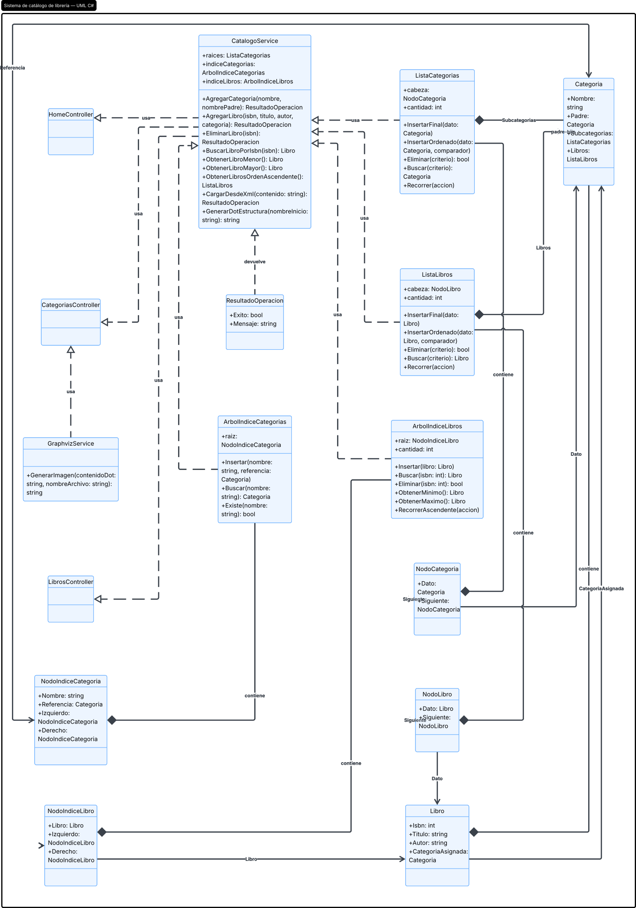
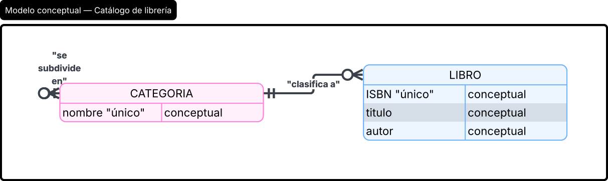
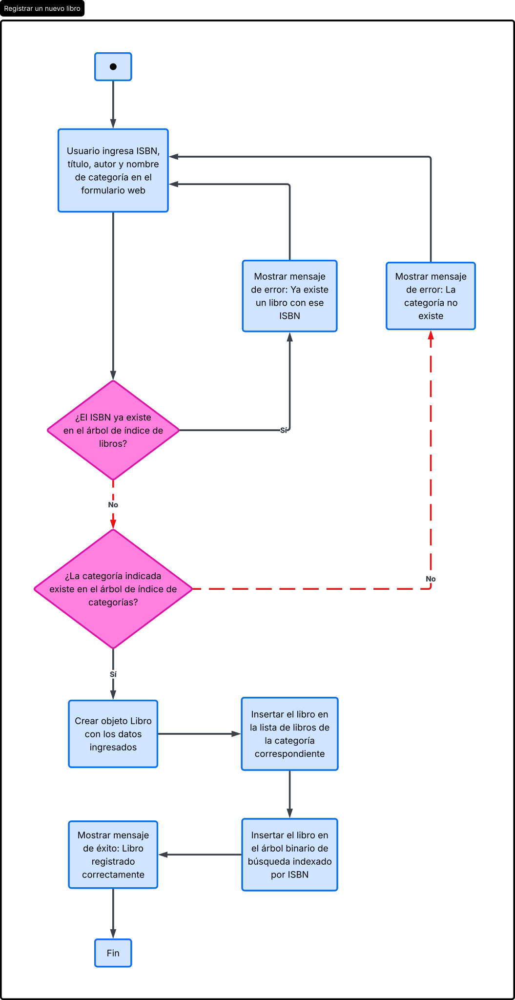

**ESTRUCTURAS DE DATOS NO LINEALES PARA LA ORGANIZACIÓN JERÁRQUICA Y BÚSQUEDA EFICIENTE DE CATÁLOGOS BIBLIOGRÁFICOS: CASO DE UN SISTEMA WEB EN C#**

**Carné 202400634 — Oliver Jorge Raxtún Morales**

---

## Resumen

Los sistemas de gestión bibliotecaria enfrentan crecientes exigencias de eficiencia conforme aumenta el volumen de su catálogo. Este ensayo describe el diseño e implementación de un sistema web en C# (ASP.NET Core MVC) para administrar el catálogo de una cadena de librerías, organizado jerárquicamente en categorías y subcategorías, de forma similar a la disposición física de una biblioteca. La solución evita el uso de colecciones nativas del lenguaje, como List, Queue o Stack, e implementa Tipos de Dato Abstracto propios: una lista simple enlazada y dos árboles binarios de búsqueda utilizados como índices, uno por nombre de categoría y otro por ISBN de libro, que reducen la complejidad de búsqueda de un recorrido lineal a un promedio logarítmico. Se describe además la carga incremental de configuraciones desde archivos XML y la generación de representaciones gráficas del catálogo mediante Graphviz. Se concluye que la selección adecuada de estructuras de datos no lineales resulta determinante para sostener el crecimiento de catálogos con más de cien mil libros sin degradar el tiempo de respuesta.

> **Palabras clave**
> Árbol binario de búsqueda, Tipo de Dato Abstracto, catálogo jerárquico, estructura de datos no lineal, C#.

## *Abstract*

*Library management systems face growing efficiency demands as their catalog volume increases. This essay describes the design and implementation of a C# web system (ASP.NET Core MVC) for managing the catalog of a bookstore chain, organized hierarchically into categories and subcategories, similar to the physical layout of a library. The solution avoids native language collections, such as List, Queue, or Stack, and instead implements custom Abstract Data Types: a generic singly linked list and two binary search trees used as indexes, one by category name and another by book ISBN, which reduce search complexity from a linear traversal to a logarithmic average. The incremental loading of configurations from XML files and the generation of graphical representations of the catalog through Graphviz are also described. It is concluded that choosing appropriate nonlinear data structures is decisive for sustaining the growth of catalogs with more than one hundred thousand books without degrading system response time.*

> ***Keywords***
> *Binary search tree, Abstract Data Type, hierarchical catalog, nonlinear data structure, C#.*

---

## Introducción

La gestión manual de catálogos bibliográficos extensos genera tiempos de búsqueda excesivos y dificulta identificar qué libros comparten temática, especialmente cuando el volumen supera los cien mil ejemplares distribuidos en varias sucursales. Frente a este problema, una cadena de librerías requiere un sistema capaz de organizar su catálogo de forma jerárquica, similar a una biblioteca física dividida por secciones y estanterías, y de localizar cualquier libro por su código o título sin recorrer toda la colección. Este ensayo expone el análisis y diseño de una solución orientada a objetos en C#, sustentada en Tipos de Dato Abstracto (TDA) desarrollados por el estudiante, sin recurrir a las colecciones nativas del lenguaje. Se plantea como propósito principal demostrar que una estructura de árbol jerárquico combinada con índices basados en árboles binarios de búsqueda permite mantener tiempos de búsqueda reducidos incluso cuando el catálogo crece significativamente.

## Desarrollo del tema

### a. Contexto y problemática

Una biblioteca física organiza su acervo en un mapa general del cual se derivan áreas principales, categorías más específicas y, finalmente, los ejemplares individuales. Replicar digitalmente esa lógica exige una estructura de datos capaz de representar relaciones de jerarquía —similares a un organigrama o a un sistema de carpetas— en la cual cada categoría puede contener un número arbitrario de subcategorías, y cada una de ellas, a su vez, un conjunto de libros. Adicionalmente, la gerencia exige que la búsqueda de un libro por su ISBN no dependa de recorrer linealmente miles de registros, sino que se mantenga eficiente aun cuando el catálogo crezca de forma sostenida. Estas dos exigencias —organización jerárquica y búsqueda eficiente— determinaron la selección de las estructuras de datos empleadas.

### b. Diseño de las estructuras de datos (TDA)

Para cumplir con la restricción de no utilizar colecciones propias de .NET (`List`, `Dictionary`, `Queue`, `Stack`), se diseñaron tres Tipos de Dato Abstracto desde cero:

1. **Lista simple enlazada (`ListaSimple`).** Se utiliza para representar el conjunto de subcategorías de cada categoría —mantenido siempre ordenado alfabéticamente mediante inserción ordenada— y el conjunto de libros asociados directamente a una categoría.
2. **Árbol binario de búsqueda indexado por nombre (`ArbolIndiceCategorias`).** Actúa como un índice paralelo a la jerarquía de categorías, permitiendo verificar en tiempo logarítmico promedio si un nombre de categoría ya existe —requisito indispensable, dado que los nombres deben ser únicos en todo el catálogo— y localizar la referencia a cualquier categoría sin recorrer el árbol jerárquico completo.
3. **Árbol binario de búsqueda indexado por ISBN (`ArbolIndiceLibros`).** Cada libro se inserta simultáneamente en la categoría a la que pertenece y en este árbol, que expone operaciones de inserción, búsqueda, eliminación, obtención del mínimo y del máximo, y un recorrido in-orden que produce naturalmente el listado de libros en orden ascendente de ISBN.

La combinación de un árbol jerárquico (para la organización conceptual) con dos árboles binarios de búsqueda (para la localización eficiente) evita el compromiso habitual entre una estructura fácil de recorrer visualmente y una estructura rápida de consultar: cada objeto `Categoria` y `Libro` es referenciado simultáneamente desde ambas vistas, sin duplicar la información.

### c. Arquitectura de la solución

El sistema se implementó como una aplicación web ASP.NET Core MVC, siguiendo el patrón Modelo-Vista-Controlador. La capa de modelo contiene las entidades `Categoria` y `Libro`; un servicio central (`CatalogoService`), registrado como instancia única de la aplicación, concentra la lógica de negocio: alta y baja de categorías y libros, validación de unicidad, y procesamiento incremental de archivos de configuración en formato XML, en los cuales los elementos `listaCategorias` y `listaLibros` son opcionales, permitiendo ampliar el catálogo mediante múltiples cargas sucesivas sin perder la información ya registrada. Los controladores exponen esta lógica a tres módulos de la interfaz: gestión de categorías, gestión de libros y ayuda, cada uno con sus respectivas vistas.

### d. Visualización con Graphviz

Para satisfacer el requerimiento de mostrar gráficamente la organización del catálogo, se incorporó un servicio adicional que traduce la jerarquía de categorías —y, alternativamente, los libros de una categoría específica en orden ascendente de ISBN— a una descripción en lenguaje DOT, la cual es procesada por la herramienta externa Graphviz para producir una imagen. Esta funcionalidad puede invocarse desde cualquier nodo de la jerarquía, permitiendo visualizar tanto el catálogo completo como la estructura derivada de una subcategoría particular, sin necesidad de reconstruir la vista general.

## Conclusiones

El diseño de un sistema de catálogo jerárquico no puede resolverse adecuadamente con una única estructura de datos: se requiere una estructura que exprese la jerarquía conceptual (árbol de categorías con listas simples enlazadas) y, de forma complementaria, estructuras de indexación (árboles binarios de búsqueda) que garanticen tiempos de búsqueda reducidos independientemente del tamaño del catálogo. Implementar estos Tipos de Dato Abstracto desde cero, en lugar de recurrir a las colecciones nativas del lenguaje, permitió comprender con mayor profundidad el costo real de cada operación —inserción ordenada, búsqueda, eliminación y recorrido— y tomar decisiones de diseño fundamentadas en dicho costo, en lugar de asumirlas como una caja negra. La integración de Graphviz demostró además que una misma estructura de datos puede servir simultáneamente a la lógica de negocio y a la generación de representaciones visuales, sin necesidad de mantener una segunda copia de la información. Queda abierta la posibilidad de sustituir los árboles binarios de búsqueda simples por variantes autobalanceadas (AVL o rojo-negro) para garantizar el tiempo logarítmico también en el peor caso, particularmente relevante si las categorías o los libros se cargan en un orden ya ordenado.

## Referencias bibliográficas

Cormen, T. H., Leiserson, C. E., Rivest, R. L., & Stein, C. (2009). *Introduction to algorithms* (3rd ed.). MIT Press.

Fowler, M. (2002). *Patterns of enterprise application architecture*. Addison-Wesley.

Gansner, E. R., & North, S. C. (2000). An open graph visualization system and its applications to software engineering. *Software: Practice and Experience, 30*(11), 1203–1233.

Microsoft. (2023). *ASP.NET Core MVC overview*. Microsoft Learn. https://learn.microsoft.com/aspnet/core/mvc/overview

World Wide Web Consortium. (2008). *Extensible Markup Language (XML) 1.0* (5th ed.). https://www.w3.org/TR/xml/

